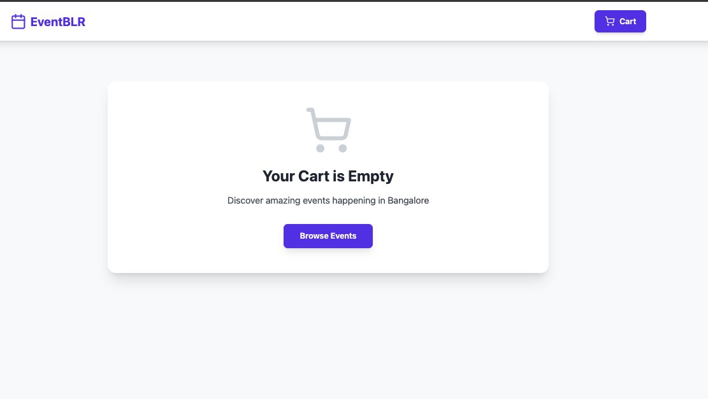

# Event Booking Web App

A simple React application to browse and book events in Bangalore.

---

## Setup Instructions

### Prerequisites
- Node.js (v18 or higher)
- npm

### Steps to Run

1. **Clone the repository**
```bash
git clone https://github.com/rittik987/react-web.git
cd react-web
```

2. **Install dependencies**
```bash
npm install
```

3. **Start the app**
```bash
npm run dev
```

4. **Open in browser**
```
http://localhost:5173
```

---

## Features

- Browse all events with sorting (by date, price)
- View full event details
- Add events to cart
- Remove events from cart
- See total booking amount
- Cart data saved in localstoarge

---

## Technologies Used

- **React** - UI components
- **Vite** - Development tool
- **React Router** - Page navigation
- **Context API** - Cart state management
- **Tailwind CSS** - Styling
- **lucide-react** - Icons
- **localStorage** - Data storage

---

## Screenshots

### 1. Event List Page
Browse all available events with sorting option


---

### 2. Event Details Page
View complete event information and book the event


---

### 3. Booking Cart - With Items
View all booked events with total amount


---

### 4. Empty Cart
Empty state when no events are in cart



---

### 5. Mobile View
Responsive design for mobile devices


---

### 6. Cart Badge & Sorting
Cart counter and sorting functionality


---

## Project Structure

```
react-web/
├── public/
│   └── images/              # Event images
├── screenshots/             # Project screenshots (6 images)
│   ├── 1-event-list.png
│   ├── 2-event-details.png
│   ├── 3-cart-items.png
│   ├── 4-empty-cart.png
│   ├── 5-mobile-view.png
│   └── 6-cart-badge-sorting.png
├── src/
│   ├── assets/
│   ├── components/
│   │   ├── EventCard.jsx
│   │   └── Navbar.jsx
│   ├── context/
│   │   └── BookingContext.jsx
│   ├── data/
│   │   └── events.json
│   ├── pages/
│   │   ├── BookingCart.jsx
│   │   ├── EventDetails.jsx
│   │   └── EventList.jsx
│   ├── App.jsx
│   ├── index.css
│   └── main.jsx
├── .gitignore
├── eslint.config.js
├── index.html
├── package.json
├── package-lock.json
├── postcss.config.js
├── README.md
├── tailwind.config.js
└── vite.config.js
```

---

## How It Works

1. User browses events on homepage
2. Clicks on event to see details
3. Clicks "Book Now" to add to cart
4. Cart page shows all booked events
5. User can remove events or proceed to checkout
6. Cart data is saved and persists after refresh

Assignment Completion
This project was built as part of a React.js Internship Assignment. All requirements from the assignment have been successfully implemented:
 Event List Page - Displays events with title, date, location, and price from JSON data with sorting functionality
 Event Details Page - Shows complete event details with a "Book Now" button that adds events to the cart
 Booking Cart Page - Displays selected events with total amount and remove option


Technical Requirements Met:

 React with functional components and hooks
 Context API for state management
 Tailwind CSS for styling
 Proper folder structure
 Clean, maintainable code

✅ Deliverables:

GitHub repository at /react-web
README with setup instructions
Screenshots of all working pages